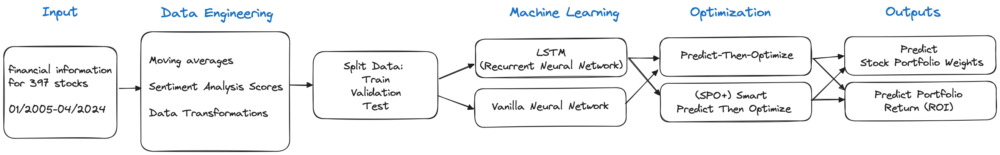

# Long-Term Asset Management and Portfolio Optimization using LSTM & Predict-Then-Optimize Models

## About the project

Investment optimization is a vital component of financial management, leveraging quantitative analysis to determine the optimal asset allocation that maximizes returns while minimizing risk. This project delves into the application of advanced deep learning models to predict which stock investments will produce the maximum return of investment and optimize their weights. We specifically implemented LSTM (RNN) + Predict-Then-Optimize, and LSTM + Smart Predict-then-Optimize (SPO+) models. Through this analytical exploration, the project aims to shed light on the latest developments in algorithmic trading and asset management. Our final goal for the project is enhancing the accuracy and efficacy of investment decisions.

## How to get started

### 1. Alpha Vantage API Key setup
1. Go to the folowing link https://www.alphavantage.co/support/#api-key
2. Get your own API key and save it
3. Create `.env` file and create a variable 
`api_key="YOUR ACTUAL KEY"`

### 2. Install Dependencies
- numpy
- pandas
- ta
- yfinance
- sklearn
- tensorflow
- scipy
- torch
- pyepo
- gurobipy
- requests
- matplotlib

### 3. Order in which to operate this notebook

1. First generate stock data in `data.ipynb`
2. (Optional) generate sentiment data in `sentiment_analysis.ipynb` through Alpha Vantage. This might not be feasable with free API key since it requires large quantity of requests. You may skip this step.
3. Run Simple Neural Network + Predict-then-optimize model in `nn_pto.ipynb`
4. Run LSTM + Smart Predict-then-optimize (SPO+) mode in `lstm.ipynb`.

⚠️ **Caution:** Avoid committing large files to GitHub and utilize a `.gitignore` file. If you rename any large CSV files, make sure you add them to the `.gitignore` file to prevent them from being committed and causing errors on your end.

### 4. Technical Aspects of Each Model

